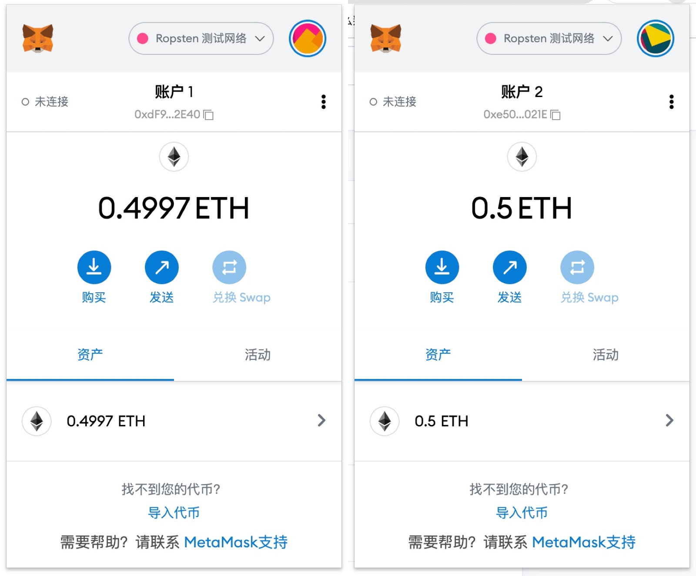
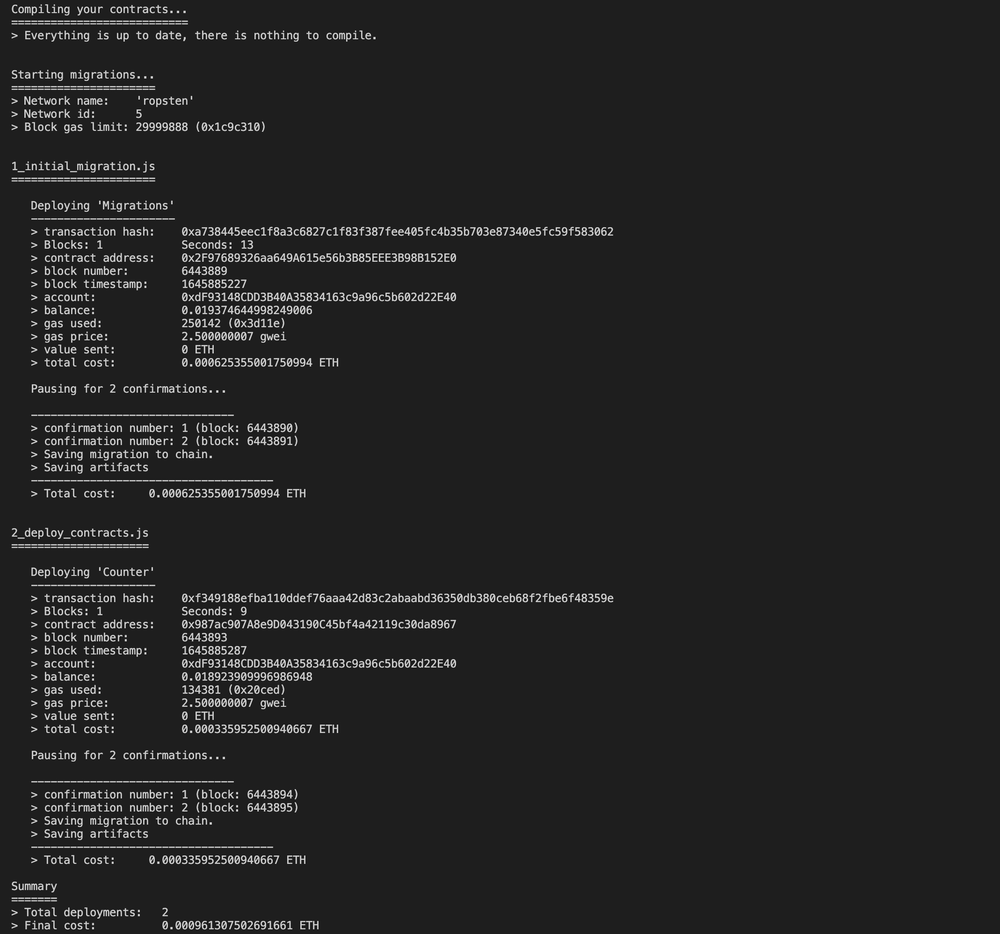

# W1-1作业：
## 安装 Metamask、并创建好账号
遇到的问题：Metamask默认不显示测试网络，需要去高级设置中把显示测试网络选项打开


## 执行一次转账交易
[转账交易](https://ropsten.etherscan.io/tx/0x529013f922f760a897c996e91111e4acc66aca1d39819c2e6d1c0472db1476d3)
## 使用 Remix 创建任意一个合约
创建了一个默认Storage合约，[合约部署交易地址](https://ropsten.etherscan.io/tx/0x5eb04720c76d0d3f17fa110c2040bcb0441586fda39aafa48685185cb02d71e0)
## VSCode IDE 开发环境配置
安装了node和npm，并且全局安装truffle模块和ganache软件
mac环境安装truffle过程中碰到了目录权限问题，查询得知是pkg安装包安装方式导致的包目录在系统目录导致的，所以卸载了node和npm，使用nvm版本管理软件重新安装node得以解决
## 使用 Truffle 部署 Counter 合约 到 test 网络（goerli）
[Counter合约地址](https://goerli.etherscan.io/address/0x987ac907a8e9d043190c45bf4a42119c30da8967)


## 编写一个测试用例
### JS
安装MetaCoin格式照葫芦画瓢写了两个测试文件，一个js一个solidity，详见源码测试文件
```js
const Counter = artifacts.require("Counter");

contract('Counter', (accounts) => {
  it('默认的计数器应该等于0', async () => {
    const counterInstance = await Counter.deployed();
    const defaultCounert = (await counterInstance.counter.call()).toNumber();
    assert.equal(0, defaultCounert, "默认计数器不等于0"); 
  });
  it('count函数逻辑是否正确', async () => {
    const account = accounts[0];
    const counterInstance = await Counter.deployed();
    const counterBefor = (await counterInstance.counter.call()).toNumber();
    await counterInstance.count({ from: account });
    const counterAfter = (await counterInstance.counter.call()).toNumber();
    assert.equal(counterBefor+1, counterAfter, "count步长不等于1或者溢出"); 
  });
});
```
### Solidity
```solidity
pragma solidity >=0.4.22 <0.9.0;

import "truffle/Assert.sol";
import "truffle/DeployedAddresses.sol";
import "../contracts/Counter.sol";

contract TestCounter {

  function testInitialCounterUsingDeployedContract() public {
    Counter counter = Counter(DeployedAddresses.Counter());
    uint expected = 0;
    Assert.equal(counter.counter(), expected, "default counter should be 0");
  }

  function testInitialCounterWithNewCounter() public {
    Counter counter = new Counter();
    uint expected = 0;
    Assert.equal(counter.counter(), expected, "default counter should be 0");
  }

}
```