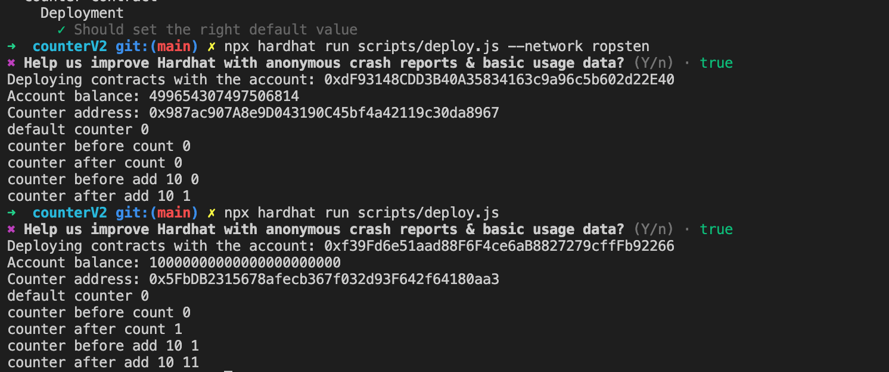
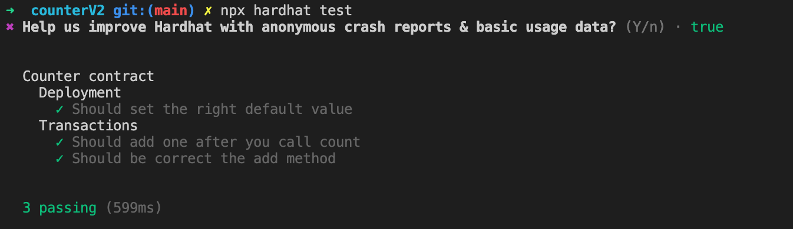

# W1-2作业：
## 使用Hardhat部署修改后的Counter
增加了一个add方法，代码详见counterV2文件夹，部署成功[交易地址](https://ropsten.etherscan.io/tx/0xf5ba6271ee575128e22b713f0192cab1406658c3a25a44b123899e63ffad56dd)
❌但是部署过程的状态输出不对，还在寻找问题所在,hardhat本地网络部署没有问题

## 使用Hardhat测试Counter
测试成功，代码详见counterV2文件夹
## 写一个脚本调用count()
```javascript
const {ethers, network} = require("hardhat");
const CONSTRACT_INFO = require(`../deployments/${network.name}/Counter.json`)
async function main() {
    let [owner] = await ethers.getSigners();
    let counter = await ethers.getContractAt("Counter",CONSTRACT_INFO.address,owner);
    await counter.count();
    console.log((await counter.counter()).toString());
}
main()
    .then(() => process.exit(0))
    .catch(error => {
        console.error(error);
        process.exit(1);
    });
```