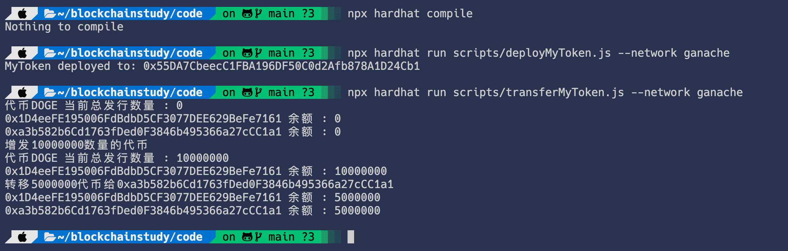
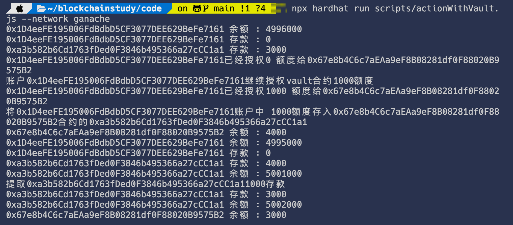

# W3_1作业

## 发⾏⼀个 ERC20 Token

- [x]  可动态增发（起始发⾏量是 0）
- [x]  通过 ethers.js. 调⽤合约进⾏转账

实现了一个[MyToken](./code/MyToken.sol)继承自一个实现了[标准ERC20接口](./code/IERC20.sol)的[ERC20](./code/ERC20.sol)

通过扩展实现`function mint(address account, uint256 amount) external onlyOwner`方法控制代币的增发
通过[deployMytoken.js](../code/scripts/deployMyToken.js)脚本部署

可以通过基于ethers.js的[脚本](./scripts/transferMyToken.js)与合约进行转账交互

## 编写⼀个Vault 合约：
  - [x] 编写deposite ⽅法，实现 ERC20 存⼊ Vault，并记录每个⽤户存款⾦额 ， ⽤从前端调⽤（Approve，transferFrom） 
  - [x] 编写 withdraw ⽅法，提取⽤户⾃⼰的存款 （前端调⽤）
  - [x] 前端显示⽤户存款⾦额
  - [ ] 待实现前端页面
  
通过实现`function deposite(address account,uint256 amount) public`方法配合ERC20合约的`function approve(address spender,uint256amount) public`
通过`function withdraw(uint256 amount) public`方法将用户存入的ERC20代币取出返还
来实现将ERC20代币存入合约vault管理

通过[deployVault.js](../code/scripts/deployVault.js)脚本部署

可以通过基于ethers.js的[脚本](./scripts/actionWithVault.js)与合约进行交互

